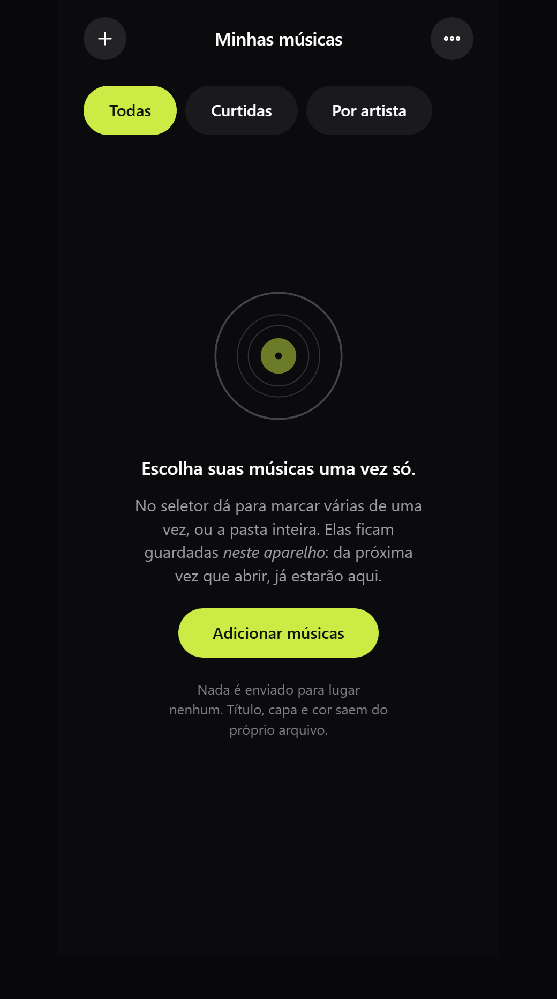
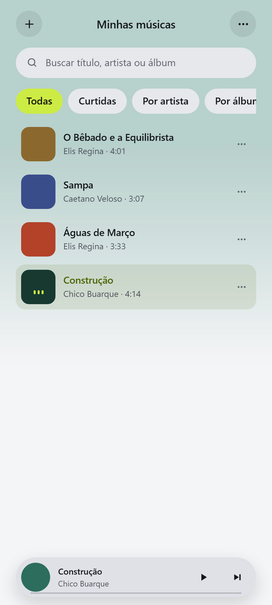
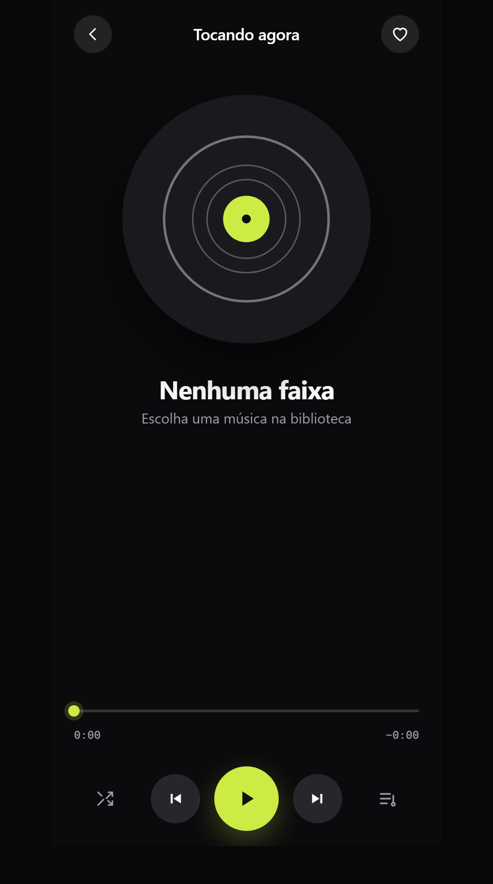

# ◉ Vitrola

Toca os MP3 do seu computador. Lê as etiquetas do arquivo, tira a cor que manda na capa e **tematiza a interface inteira com ela**.

**HTML, CSS e JavaScript puros** — sem biblioteca, sem build, sem servidor. Nada sai da sua máquina: não há upload, porque não há para onde subir.

### 📲 [Baixar para Android](https://github.com/SkotAlexsander/vitrola/releases/latest/download/Vitrola.apk) · ▶ [Abrir no navegador](https://skotalexsander.github.io/vitrola/)

O aplicativo Android roda **inteiro dentro do aparelho** e **não pede permissão de internet** — sem essa permissão o Android não deixa o app acessar a rede nem se quisesse. É a prova de que é local, não a promessa. No iPhone use a versão web: Safari → Compartilhar → *Adicionar à Tela de Início*.

No celular, o navegador oferece instalar na tela inicial. Aí ela abre em tela cheia, funciona sem rede e aparece na folha de compartilhamento junto dos outros aplicativos.



| Tema claro | Tocando |
|---|---|
|  |  |

---

## 3.0 — de player a toca-discos

A versão 3.0 é uma reescrita. O aplicativo se chama Vitrola e mostrava **um círculo parado**; agora é um toca-discos que se comporta como um: o prato gira enquanto toca e **para onde estava** quando pausa, um brilho fixo passa por cima do disco em rotação, e o braço desce quando a música começa e **caminha para o miolo** conforme a faixa anda — a posição dele *é* a barra de progresso, dita de outro jeito.

Junto vieram as coisas que faltavam para ser usável com mais de cinquenta músicas:

| Novo | |
|---|---|
| **Buscar** | por título, artista ou álbum, sem acento e sem maiúscula (`musica` acha *Música*) |
| **Fila de verdade** | abre numa folha, mostra em que ponto está, pula para qualquer faixa, limpa o que já passou. Do menu da faixa: *tocar a seguir* e *pôr no fim da fila* |
| **Playlists** | criar, pôr, tirar — guardadas junto com o resto |
| **Por álbum** | além de por artista; os dois abrem e voltam |
| **Ordenar** | por adição, título, artista, álbum, duração ou mais ouvidas — a contagem de escutas é feita aqui e não sai do aparelho |
| **Editor decente** | título, artista e álbum na mesma folha, trocar a capa e importar letra `.lrc` com marcação de tempo |
| **A letra inteira** | toca na letra e ela abre; se for sincronizada, tocar numa linha pula a música para aquele ponto |
| **Equalizador** | 5 bandas com atalhos (Plano, Grave, Voz, Agudo, Noite), volume até 150% e velocidade de 0,75× a 2× **sem alterar o tom** |
| **Timer para dormir** | 10 a 60 minutos, ou *no fim desta faixa*, com o quanto falta no próprio botão |
| **Retoma de onde parou** | mesma faixa, mesmo segundo, **pausada** — voltar tocando sozinho ao abrir assusta |
| **Repetir** | os três estados de verdade; e deslizar no disco troca de faixa |

E o que estava quebrado e ninguém tinha visto:

- **Repetir não existia.** `estado.repetir` estava preso em `'tudo'`; os modos `'uma'` e `'nao'` estavam escritos e eram inalcançáveis, porque não havia botão.
- **O arranque abria uma sonda por faixa.** Com 300 músicas eram 300 elementos `<audio>` e 300 URLs de objeto criados de uma vez só para descobrir a duração — e a duração nem era guardada, então repetia a cada abertura.
- **Capa de toda faixa ficava na memória.** Um `createObjectURL` por capa, criado no arranque, nunca devolvido. Agora a URL nasce quando a linha aparece, e as mais antigas são devolvidas.
- **A fila usava índices.** Como não dava para remover faixa, o problema estava dormindo: no dia em que a remoção entrasse, todo índice guardado passaria a apontar para a vizinha, calado. A fila passou a guardar UID.
- **"Ver a fila" voltava para a biblioteca** — o botão tinha esse nome e fazia outra coisa.
- **Renomear era `window.prompt`**: dois diálogos do sistema em sequência, sem álbum e sem como desistir no meio.

O banco sobe da versão 1 para a 2 sozinho e **nada é apagado**: faixas, capas e curtidas que já estão no aparelho continuam lá.

> **A ponte com o Java não mudou.** `Sistema.midia()`, `Sistema.pararMidia()`, `Sistema.tema()`, `Sistema.diagnostico()`, `window.__midia()` e `window.__voltar()` continuam com os mesmos nomes e as mesmas assinaturas — o aplicativo Android recompila sem tocar numa linha de Java.

---

## Os arquivos

| Arquivo | O que é |
|---|---|
| [index.html](index.html) | A página |
| [style.css](style.css) | A aparência — a parte que é o produto |
| [app.js](app.js) | Tudo o mais, em 11 seções numeradas |
| [sw.js](sw.js) | Service worker: guarda a casca para abrir sem rede |
| [testes/testar.js](testes/testar.js) | Carrega o `app.js` num DOM falso e testa a lógica pura |
| [android/](android/) | O aplicativo Android — as fontes Java e como recompilar |

---

## A ideia visual

A referência é o **selo Elenco** — as capas que Aloysio Magalhães desenhou no começo dos anos 60. Preto, branco e **uma** cor chapada. Tipografia pesada e apertada, muito espaço vazio.

Isso resolveu o problema central de graça: o requisito "a cor da capa tematiza a interface" *é* o sistema da Elenco. A cor extraída vira a única cor.

Daí a regra que manda em tudo:

> **A cor de acento não existe até entrar uma faixa.** A interface nasce em preto e branco, e é o álbum que a colore.

O acento fica preso a quatro lugares — a onda, o progresso, a faixa ativa na fila e um fio. Todo o resto permanece preto e branco. Ousadia em um lugar só; o entorno quieto.

### Os neutros foram medidos, não escolhidos a olho

Três níveis de texto, cada um com contraste conferido contra o fundo do seu tema:

| Token | Papel | Claro | Escuro |
|---|---|---|---|
| `--texto` | título, corpo | 15,9:1 | 15,9:1 |
| `--fraco` | artista, rótulos | 7,2:1 | 6,9:1 |
| `--tenue` | número, duração, álbum, rodapé | 4,5:1 | 4,6:1 |
| `--limite` | trilho do volume, onda não tocada | 3,0:1 | 3,0:1 |

A escala é comprimida de propósito. Um cinza mais claro que `--tenue` ficaria bonito e ilegível — o valor que eu tinha antes media **1,93:1**, e estava no número da faixa, na duração, no álbum e no rodapé.

**Uma exceção, deliberada:** `--borda` fica em 1,2:1 e não é um defeito. O WCAG 1.4.11 cobre o que é preciso para identificar um componente ou entender o conteúdo; um filete decorativo entre seções não é nem um nem outro. Onde o contorno de fato informa — o trilho do volume, a parte não tocada da onda — existe `--limite`, e ele passa em 3:1.

---

## O que tem dentro

### Um leitor de ID3 escrito à mão

Sem biblioteca. Lê **ID3v2.2, v2.3 e v2.4** — título, artista, álbum, ano, faixa e a capa embutida (quadros `APIC` e `PIC`) — e cai para o **ID3v1** dos 128 bytes finais quando não há v2. Sem etiqueta nenhuma, usa o nome do arquivo.

Duas asperezas do formato que o código trata de propósito:

- **Tamanho sincro-seguro.** No v2.4 o tamanho do quadro usa 7 bits por byte, para nunca imitar um quadro de sincronismo de MP3. Só que há codificador que grava v2.4 com tamanho comum, fora da norma. O leitor tenta a leitura correta e, se o próximo quadro não fizer sentido, tenta a outra.
- **Quatro codificações de texto** por quadro (`ISO-8859-1`, `UTF-16` com BOM, `UTF-16BE`, `UTF-8`), e a descrição da capa terminando em nulo **duplo** quando o texto é UTF-16.

### A cor, e o problema que ela cria

Achar a cor dominante é a parte fácil: reduz a capa a 56×56, joga os pixels em 30 faixas de matiz e pondera por viveza — assim um detalhe saturado ganha de uma área grande e barrenta. Cinza e os extremos de luminosidade ficam de fora.

O problema é o seguinte: **capa clara gera cor clara, que some no fundo claro.** Então a cor extraída passa por correção de luminosidade até bater **4,5:1 de contraste WCAG** contra o fundo do tema em vigor — e é recalculada quando você troca o tema, porque o alvo muda.

A matiz nunca é tocada. Só a luminosidade. O amarelo continua amarelo:

| Cor extraída | Tema claro | Tema escuro |
|---|---|---|
| amarelo `l=0.60` | `l=0.24` — 4,6:1 | `l=0.60` — 14,5:1 |

### O prato é a barra de progresso

O disco não é enfeite. Ele **gira enquanto toca e para onde estava** quando você pausa, como um prato de verdade — não volta ao começo. Um brilho fixo passa por cima do que gira, e é esse brilho que faz a rotação parecer física em vez de um GIF: sem uma luz parada, um círculo girando não tem como provar que está girando. Os sulcos são anéis finos por cima da capa, no que gira.

O braço desce quando a música começa e caminha para o miolo conforme a faixa anda. Ele **é** o progresso, dito de outro jeito — a barra continua ali embaixo para quem quiser o número.

Quem não quiser o giro desliga nos ajustes, e quem tem *reduzir movimento* ligado no sistema já recebe tudo parado.

Na lista, a faixa que toca ganhou **três barrinhas dançando sobre a capa**, que param quando a música para: dá para ver o que está tocando sem depender só de cor.

> Até a 2.x isto era uma **onda** — mil picos de amplitude decodificados num `OfflineAudioContext` descartável. Bonito, e caro: decodificar o arquivo inteiro para desenhar uma barra. O prato conta a mesma coisa (onde está, quanto falta) usando o que o aplicativo já é.

### A tela de bloqueio, e por que ela precisou de duas implementações

Capa, título e artista aparecem **na tela de bloqueio** e na aba de notificação, com os controles do sistema funcionando — inclusive arrastar a posição.

No navegador isso é a **Media Session API**: poucas linhas, e quase ninguém implementa.

No aplicativo Android o mesmo código **não faz nada** — e essa é a parte que só se descobre perguntando. Quem lê `navigator.mediaSession` e desenha aquele card é o *navegador*. Dentro de um WebView não há navegador, então não há quem leia. O card do aplicativo é montado em Java: uma `MediaSession` de verdade mais uma notificação `MediaStyle`, num **serviço de primeiro plano**.

O serviço não é zelo excessivo. Sem ele o Android encerra o processo quando a tela apaga, e a música para sozinha no meio.

O `<audio>` continua morando no JavaScript; o Java não toca em som nenhum. O que atravessa a ponte é só o recado do que está tocando, e de volta o que o dedo apertou.

> [!warning] O serviço não pede foco de áudio, e isso é deliberado
> A primeira versão pedia, e o aplicativo pausava sozinho a cada play. Quem toca o som é o `<audio>` dentro do WebView, e **o WebView já pede foco de áudio por conta própria** quando a reprodução começa. Com o serviço pedindo também, viravam dois pedintes dentro do mesmo aplicativo — e quem pede por último tira o foco de quem pediu antes. Perdendo o serviço, o ouvinte dele mandava pausar; perdendo o WebView, ele pausava a mídia. Nas duas ordens dava no mesmo.
>
> Quem é dono do som é dono do foco. Há um teste que falha se `requestAudioFocus` voltar ao código, porque esse é o tipo de coisa que se reintroduz por boa intenção.

> A ponte tem freio: o `timeupdate` dispara quatro vezes por segundo, e mandar tudo isso seria desperdício. A barra da tela de bloqueio anda sozinha, extrapolando da posição e da velocidade — só preciso corrigir de cinco em cinco segundos, e na hora exata em que algo muda de repente.

### Um diagnóstico, porque o Android falha calado

No menu do aplicativo há um item **Diagnóstico** — escondido no navegador, onde não faria sentido.

Ele existe por uma razão prática: o card da tela de bloqueio depende de três peças que só existem do lado Android — a permissão de notificação, o serviço de primeiro plano e a sessão de mídia — e quando uma falha, ela falha *em silêncio*. Some o card, e nada diz por quê. São três consertos diferentes, e sem saber qual, a única saída seria compilar uma versão nova a cada palpite.

O relatório junta o que só o Java sabe (permissão, serviço, sessão, versão do Android) com o que só a página sabe (se a ponte existe, se algum recado saiu, se o áudio subiu). Sai por `alert`, de propósito: no aplicativo isso abre um diálogo nativo, e **ver esse diálogo já é meia resposta** — prova que o caminho de volta do Java para a página funciona.

### Consertar o nome na mão

Etiqueta de MP3 mente. O menu de cada faixa abre um editor com **título, artista e álbum na mesma folha** — e explica para que serve, porque quem tem etiqueta com os quadradinhos `██` não sabe que aquilo tem conserto. Também dá para trocar a capa e importar a letra de um `.lrc`. A correção fica valendo depois de fechar o aplicativo.

Antes de precisar dele, o leitor tenta sozinho: **o embaralhamento mais comum não deixa losango nenhum.** Um arquivo gravado em UTF-8 mas etiquetado como latin1 vira `Ação` — todo caractere imprimível, nada que um contador de caracteres estranhos ache errado. Só o olho humano vê. Então esse caso é pego por outra pergunta: *os bytes formam UTF-8 válido?* Texto latin1 de verdade quase nunca passa nesse teste por acaso — as sequências de vários bytes do UTF-8 são exigentes demais para sair por acidente.

### É um aplicativo de celular

Vitrola é um **PWA**: instala na tela inicial, abre em tela cheia sem barra de navegador e funciona sem rede.

| | |
|---|---|
| **Instalar** | Android: o botão *Instalar* aparece sozinho na barra de cima. iOS: Safari → Compartilhar → *Adicionar à Tela de Início* |
| **Sem rede** | O service worker guarda a casca inteira. Depois da primeira visita, abre no avião |
| **Compartilhar para a Vitrola** | ⚠️ **Pela metade.** No Android ela aparece na folha de compartilhamento e o service worker recebe o POST e guarda os arquivos — mas **a página ainda não os recolhe**. Quem compartilha um áudio hoje vê o app abrir e não encontra a música |
| **Abrir com** | Com o app instalado, tocar num arquivo de áudio pode abrir a Vitrola direto |
| **Tela de bloqueio** | Capa, título, artista e os controles do sistema, pela Media Session |
| **Áreas seguras** | `env(safe-area-inset-*)` no padding — instalado no iOS o conteúdo passaria por baixo do relógio |

Duas decisões de produto que valem dizer:

- **O controle de volume some no telefone.** O aparelho já tem um, no lado. Repetir na tela roubava largura do transporte, que é o que se usa de fato. O botão de mudo fica — silenciar depressa é outra intenção.
- **A capa é limitada pela altura, não pela largura.** Em pé, uma capa quadrada de largura total empurra os controles para baixo da dobra. Num player, ter de rolar para dar pausa é defeito.

> [!warning] PWA exige HTTPS
> Aberto por duplo clique (`file://`) o registro do service worker falha — de propósito, em silêncio. O player continua inteiro, só sem instalar e sem offline. Para instalar de verdade, tem de vir de um endereço `https://`.

**No iOS há limite:** a Apple não oferece o botão de instalar (é pelo menu Compartilhar), não implementa `share_target`, e reprodução em segundo plano num PWA é menos confiável que no Android. Nada disso quebra o app — apenas não é igual nos dois.

### Some mais

- **A biblioteca sobrevive ao fechar** — os arquivos ficam no IndexedDB, e a sessão retoma na mesma faixa e no mesmo segundo, pausada
- Arrastar e soltar em qualquer lugar da página
- Três temas: escuro, claro e **do sistema**
- Aleatório, e repetir com os três estados
- Folhas que sobem de baixo e fecham arrastando; recado visível quando algo acontece
- Tela de 660px de altura ou menos encolhe o disco e esconde a letra, em vez de espremer tudo
- Teclado: <kbd>espaço</kbd>/<kbd>K</kbd> tocar · <kbd>←</kbd> <kbd>→</kbd> pular · <kbd>S</kbd> aleatório · <kbd>R</kbd> repetir · <kbd>L</kbd> curtir · <kbd>Q</kbd> fila · <kbd>/</kbd> buscar · <kbd>Esc</kbd> voltar
- O brilho do fundo é a própria capa ampliada e desfocada, com um pulso que respira nos graves pelo `AnalyserNode`

---

## O que foi verificado

```bash
node testes/testar.js                      # lógica pura, num DOM falso
node testes/fumaca_local.js  . <destino>   # a pasta local, num Chrome de verdade
node testes/fumaca_ao_vivo.js <mp3> <dst>  # o que o Pages está servindo AGORA
node testes/capturas.js  . <mp3> capturas  # refaz as imagens deste README
```

Os três últimos precisam do Playwright. O `fumaca_ao_vivo` é o que fecha a publicação: ele lê o `VERSAO` do `sw.js` local e confere contra o cache que o navegador registrou no site no ar — pega tanto "esqueci de subir a versão" quanto "subi e não empurrei". Como fabricar os MP3 de teste está no cabeçalho do `capturas.js` (não há música no repo: não é minha para distribuir).

| | |
|---|---|
| ID3v2.3 — UTF-16 com acento, latin1, capa PNG | ✅ |
| ID3v2.4 — tamanho sincro-seguro, UTF-8, `TDRC` | ✅ |
| ID3v2.2 — identificadores de 3 letras, quadro `PIC` | ✅ |
| Queda para ID3v1, e daí para o nome do arquivo | ✅ |
| Arquivo torto e arquivo de zero byte não derrubam o leitor | ✅ |
| Ida e volta RGB↔HSL — erro máximo **0** de 255 | ✅ |
| Correção de contraste — **648/648** cores chegam a 4,5:1, nos dois temas | ✅ |
| Formatação de tempo, inclusive `NaN` e negativo | ✅ |
| Todo par frente/fundo dos tokens, medido nos dois temas | ✅ 13/13 |
| UTF-8 etiquetado como latin1 é desembaralhado, e latin1 de verdade não | ✅ 10/10 |
| A ponte da tela de bloqueio: milissegundos, freio, `NaN`, comando desconhecido | ✅ 15/15 |

E num Chrome de verdade, com quatro MP3 de etiqueta e capa entregues pelo seletor: a biblioteca enche, a cor da capa tinge o fundo, o menu abre, o disco gira, o braço desce — **sem um erro de console, de página ou de rede**. As capturas deste README saem dessa mesma corrida, e não de um retoque.

**Não verificado:** som, o card na tela de bloqueio de um aparelho real, o toque e o deslizar no disco. Isso só olhando — e o aparelho é seu.

---

## Onde mexer

O `app.js` está em 11 seções numeradas: 1 utilidades · 2 leitor de ID3 · 3 cor da capa · 4 guarda (IndexedDB) · 5 biblioteca e fila · 6 áudio e equalizador · 7 brilho e pulso · 8 Media Session e ponte Android · 9 desenho da tela · 10 folhas · 11 entrada e arranque.

| Quero… | Vá em |
|---|---|
| Trocar os neutros ou a tipografia | topo do `style.css` |
| Mudar o alvo de contraste | `ALVO_CONTRASTE`, seção 3 |
| Mudar como a cor dominante é escolhida | `corDaImagem()`, seção 3 |
| Suportar mais quadros de ID3 | o mapa `CAMPO`, seção 2 |
| Mexer no prato, no braço ou nos sulcos | `.prato` e `.braco`, no `style.css` |
| Mudar as bandas do equalizador | `EQ_HZ` e `EQ_PADROES`, seção 6 |
| Mudar o brilho de fundo e o pulso dos graves | seção 7 |
| **Publicar uma versão nova** | ⚠️ trocar `VERSAO` no `sw.js`. A estratégia é cache-primeiro: sem trocar esse texto, quem já tem o app instalado nunca vê a versão nova |

---

## Licença

MIT — ver [LICENSE](LICENSE). A referência à Elenco é de linguagem visual, não de reprodução: nenhuma arte, marca ou tipografia do selo foi usada.
